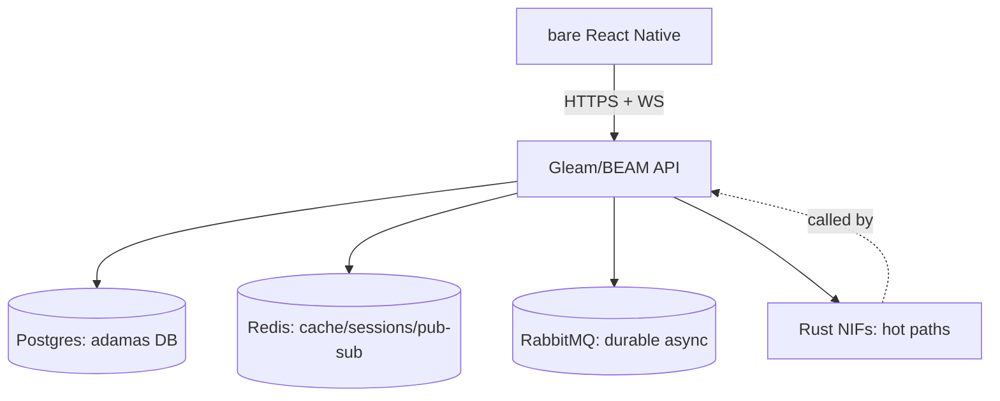

# Architecture Spine — Synapse

## Design Paradigm

**Monolith-first actor model on the BEAM.** One Gleam application owns HTTP, websockets, and OTP-managed business logic; Rust supplies NIFs only for CPU-bound hot paths. The BEAM's per-process isolation + supervisor trees give crash-recovery and massive concurrency for free. Redis is the realtime/distributed-state bus; RabbitMQ is a durable task queue engaged only when needed; Postgres is the single system of record.

Dependency direction (who may depend on whom) is enforced: frontend depends on API; API depends on data/LLM/queue layers; nothing depends upward.



## Invariants & Rules

### AD-1 — Monolith-first, no microservices
- **Binds:** all
- **Prevents:** premature service split, distributed-config sprawl, multi-deploy coordination in v1
- **Rule:** Ship one Gleam/BEAM app. No GraphQL, no Kubernetes. Extract a module to its own BEAM app only when it is demonstrably a bottleneck.

### AD-2 — Bare React Native, not Expo
- **Binds:** frontend
- **Prevents:** Expo runtime/OTA assumptions leaking into native build expectations
- **Rule:** Scaffold with the React Native CLI; target native iOS + Android builds. No `expo` dependencies.

### AD-3 — Gleam is primary; Rust is NIF-only
- **Binds:** backend
- **Prevents:** logic duplicated across two runtimes; Rust surface creeping beyond hot paths
- **Rule:** All HTTP/WS/OTP logic in Gleam. Rust appears only as NIFs for LLM stream parsing, geo math, and (later) image processing. Add a NIF only when a path is proven hot.

### AD-4 — Postgres is truth; Redis + RabbitMQ are infra
- **Binds:** data-integration-layer, identity-auth, notices, dept-year-chat, group-spaces
- **Prevents:** campus data scattered across services; cache/session state losing a single source
- **Rule:** Postgres holds students, schools, departments, years, notices, clubs, messages, group spaces (the adamas DB). Redis = cache/sessions/WS fan-out. RabbitMQ = durable async.

### AD-5 — RabbitMQ deferred to first durable-queue need
- **Binds:** campus-chatbot, notices
- **Prevents:** standing up a broker before any workload needs durability
- **Rule:** Redis pub/sub covers realtime (chat/notices) on day one. Wire RabbitMQ only when the LLM-agent pipeline requires durable task queues.

### AD-6 — LLM behind one provider abstraction
- **Binds:** campus-chatbot
- **Prevents:** provider lock-in; chatbot code knowing which LLM it calls
- **Rule:** One interface, two backends (OpenRouter, Amazon Bedrock), selected at runtime by config/credential. Fallback between providers on failure.

### AD-7 — Auth = adamas-DB match gates chat
- **Binds:** identity-auth, dept-year-chat
- **Prevents:** unverified users in dept-year rooms; separate approval workflows in v1
- **Rule:** Login validates roll number + credential against Postgres. On match, derive school/department/year and admit only to that dept-year room. No manual approval step in v1.

### AD-8 — Realtime = websocket + Redis pub/sub, history in Postgres
- **Binds:** notices, dept-year-chat, group-spaces
- **Prevents:** clients polling; message history divergence from live stream
- **Rule:** Live delivery via websocket backed by Redis pub/sub fan-out. Persist every message/notice in Postgres for history.

### AD-9 — openspec/ is source of truth; Issues are mirror
- **Binds:** all
- **Prevents:** agent state scattered across GitHub; truth read from a network tracker
- **Rule:** The `openspec/` change dirs are the canonical task/feature state. GitHub Issues may mirror status for humans but are never read as state by agents.

### AD-10 — Deferred scope
- **Binds:** all
- **Prevents:** v1 scope creep across 5 unbuilt feature areas
- **Rule:** Excluded from v1: photobooth, AI map navigation, bus navigation, location punch-in/out, Kafka. Each becomes its own later change.

## Consistency Conventions

| Concern | Convention |
| --- | --- |
| Naming (entities, files, interfaces, events) | `snake_case` for Gleam/Rust/DB identifiers; `PascalCase` for RN components; DB tables `snake_case` plural; events `{resource}.{verb}` |
| Data & formats (ids, dates, error shapes, envelopes) | Primary keys are UUIDv7; timestamps ISO-8601 UTC; API errors `{ "error": "<code>", "message": "..." }`; LLM messages use provider-agnostic envelope |
| State & cross-cutting (mutation, errors, logging, config, auth) | All Postgres writes through data layer only; config via env + BEAM app config; sessions in Redis with TTL; auth guard on every protected route/socket |

## Stack

| Name | Version |
| --- | --- |
| React Native (CLI, bare) | 0.74+ |
| Gleam | 1.x (BEAM/OTP) |
| Rust (NIF) | edition 2021 |
| Postgres | 16 |
| Redis | 7 |
| RabbitMQ | 3.13 |
| LLM providers | OpenRouter API, Amazon Bedrock |

## Structural Seed

```text
synapse/
  gleam/            # BEAM backend: HTTP, websockets, OTP, Redis/RabbitMQ clients
  rust_nif/         # Rust crate: LLM stream parse, geo math, image (later)
  react_native/     # bare RN app (iOS + Android)
  priv/migrations/  # Postgres SQL migrations + adamas DB seed
  openspec/         # change/spec/tasks = source of truth
```

## Capability → Architecture Map

| Capability / Area | Lives in | Governed by |
| --- | --- | --- |
| architecture-spine | this spine + openspec | AD-1..AD-10 |
| identity-auth | gleam auth module + Postgres + Redis sessions | AD-4, AD-7, AD-9 |
| data-integration-layer | gleam data modules + Postgres | AD-4 |
| campus-chatbot | gleam LLM module + Rust NIF + RabbitMQ (deferred) | AD-3, AD-5, AD-6 |
| notices | gleam notices module + Redis pub/sub + WS | AD-4, AD-5, AD-8 |
| dept-year-chat | gleam chat module + Redis pub/sub + Postgres | AD-3, AD-7, AD-8 |
| group-spaces | gleam groups module + Redis pub/sub + Postgres | AD-8 |

## Deferred

- **Photobooth** — image pipeline needs Rust NIF + storage; out of v1.
- **AI map navigation** — separate geospatial + rendering work; own change.
- **Bus navigation** — depends on map nav + live transit data; own change.
- **Location punch-in/out** — needs realtime geo + presence model; own change.
- **Kafka** — no replay/event-log need yet; Redis Streams or Postgres audit log suffice if needed.
- **RabbitMQ wiring** — deferred per AD-5 until LLM-agent pipeline requires durable queues.
- **Manual chat verification** — DB match is sufficient for v1 per AD-7.
